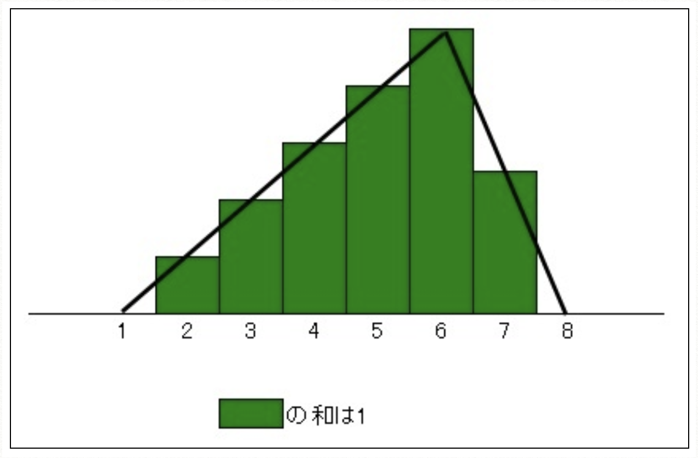

# Problem Description

Create a function that draws an integer from a probability distribution uniquely determined by the minimum [s], maximum [m], and most frequent [c] values.
The probability distribution forms a triangle such that the base is [s-1] and [m+1] and the most frequent value [c] is the vertex.
s, m, and c are integers, and the relationship is s ≤ c ≤ m.
For example, in the case of minimum value [2], maximum value [7], and maximum frequency value [6], the probability distribution is determined as follows.
In this case, the base of the triangle is [1] and [8]. The most frequent value [6] is the vertex.

# Instructions

`python3 solution.py`